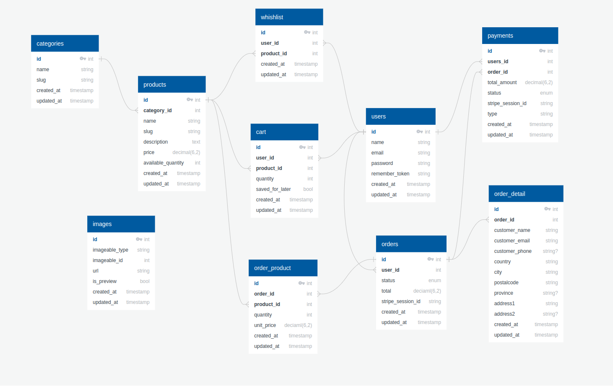

# Ecommerce app
Ecommerce built using laravel 9, vue 3, inertia.js and stripe to make payments.
I developed the project using a TDD approach. 

## DB structure

## Shop
Each user can view the products for sale and apply filters on them. 
It is possible to search for a product by name, filter the results by category or by price, all without refreshing the page. 
It is also possible to sort the results by price or by "best sellers".

https://user-images.githubusercontent.com/116803143/204110439-dc42cc84-8290-4747-94d0-bf92fe011930.mp4

Once logged in, the user can add the products to his cart, or save them in his whishlist.
When the user clicks the payment button, he is redirected to the payment page provided by stripe.   When the user enters his data and makes the payment, he is redirected to a purchase confirmation page.

https://user-images.githubusercontent.com/116803143/204110446-5cc65243-042c-4b8c-87e4-f37e233d4e54.mp4

## User Dashboard
From the dashboard a registered user can summarize his purchases, view how many orders he has placed in a period of time, how much he has spent on average, etc.
He can also view his orders in detail and update his profile information (username and password).

https://user-images.githubusercontent.com/116803143/204110452-fc9c5f6c-9a4d-4688-98d3-e59fea92cedb.mp4
